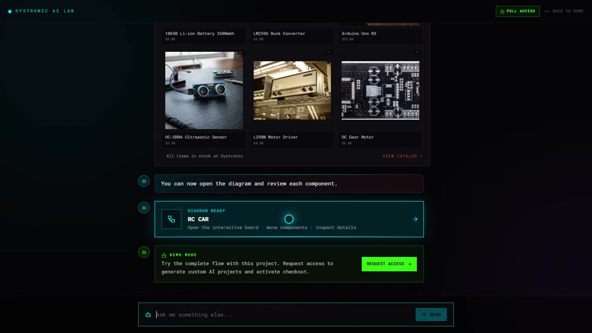

# Dystronic

Dystronic is an education-first electronics workspace that connects a local parts catalog, guided projects, courses, and an interactive wiring board. A learner can describe an idea, review a grounded system plan, inspect the parts, and move from concept to a buildable prototype.

## OpenAI Build Week 2026

- **Track:** Education
- **Submission branch:** `master`
- **Development branch:** `codex/build-week-ai-architecture`

Dystronic existed before Build Week. The submission work is documented in commit history, with the original development branch preserved for review. The Build Week extension turns the previously hard-coded AI Builder demonstration into a provider-based, catalog-grounded planning pipeline.

### Competition demo

[](https://raw.githubusercontent.com/Manceb0/DystronicWeb/master/artifacts/demo/dystronic-build-week-demo.mp4)

**[Watch the full 95-second demo with English narration →](https://raw.githubusercontent.com/Manceb0/DystronicWeb/master/artifacts/demo/dystronic-build-week-demo.mp4)**

The recording follows one continuous flow: idea → generated plan → wiring graph → mechanical dimensions → build instructions → bill of materials → checkout access.

**[Download the Devpost-ready image gallery →](artifacts/gallery)** — seven 3:2 JPGs covering the same product journey, each under 250 KB.

Suggested English captions for Devpost:

1. **Dystronic learning platform** — A unified workspace for discovering electronics projects, components, kits, courses, and community builds.
2. **AI-guided project planning** — A plain-language idea becomes a structured, catalog-grounded electronics project plan.
3. **Interactive wiring graph** — Explore component relationships, signal paths, power connections, and the complete bill of materials.
4. **Mechanical layout validation** — Inspect every component as a dimensioned volume before committing to a physical build.
5. **Step-by-step build instructions** — Follow an ordered assembly guide tied directly to the selected tools and components.
6. **Purchase-ready bill of materials** — Review availability, quantities, and estimated cost without leaving the project workflow.
7. **Demo access and checkout handoff** — Request the complete AI and commerce experience from the public, keyless demonstration.

### What is new during Build Week

- A typed project-planning contract shared by the UI, API route, and providers.
- A keyless local demo provider that works deterministically and makes no paid API calls.
- An optional GPT-5.6 provider built on the OpenAI Responses API.
- Strict structured output for project graphs, learning steps, parts, and connections.
- Server-side validation that rejects unknown catalog parts, duplicate nodes, and invalid graph edges.
- A real `/api/ai-builder` boundary with input validation and server-only secret handling.
- Dynamic scenarios: the interactive board now consumes the provider result instead of always replacing the user's request with a fixed RC-car prompt.
- Clear demo-mode disclosure and an access request path for live AI generation and checkout.

See [Architecture](docs/AI_ARCHITECTURE.md) for the full request flow and design decisions.

## Run the judge-friendly demo

The default path requires no account, API key, or paid service.

```bash
npm install
npm run dev
```

Open `http://localhost:3000/ai-builder`, enter an idea, and follow the generated plan into the interactive board. With the default environment file, the UI clearly identifies the experience as a demo.

## Optional OpenAI provider

This source path is included for architectural review. It is disabled by default and was not executed during development because the project owner does not have API credits.

```dotenv
DYSTRONIC_AI_PROVIDER=openai
OPENAI_API_KEY=your_server_side_key
OPENAI_MODEL=gpt-5.6-sol
```

Restart the development server after changing environment variables. `OPENAI_API_KEY` must never use a `NEXT_PUBLIC_` prefix. If OpenAI mode is selected without a key, Dystronic safely falls back to the local provider and discloses that fallback in the response.

## How Codex and GPT-5.6 were used

### Codex

Codex was used as the implementation partner for the Build Week extension:

- Audited the existing product and identified that user prompts were being replaced by a fixed demo prompt.
- Read the repository's bundled Next.js 16.2 documentation before introducing a Route Handler and environment-variable boundary.
- Consulted current OpenAI documentation for GPT-5.6, the Responses API, and Structured Outputs.
- Designed the provider interface, JSON Schema, catalog grounding, validation boundary, and safe demo fallback.
- Connected the existing UI to the new pipeline while preserving the visual product experience.
- Ran TypeScript, production build, and local endpoint checks.

### GPT-5.6 integration

The source includes a production-shaped GPT-5.6 provider in `src/lib/ai-builder/providers/openai.ts`. It uses the OpenAI Responses API, a catalog-grounded prompt, and strict structured output to return the same typed project graph consumed by the interactive board. The provider is selected only when `DYSTRONIC_AI_PROVIDER=openai` and a server-side `OPENAI_API_KEY` are present.

The submitted public demo runs through the keyless local provider because the project owner does not have API credits. GPT-5.6 calls were therefore not executed or presented as live model output. This separation lets judges inspect the complete GPT-5.6 integration while evaluating the full UI, validation, and rendering flow without credentials or paid calls.

Product decisions remained human-owned: Dystronic's educational focus, the no-cost default, explicit disclosure of demo behavior, and the decision not to claim an API call that was never made.

## Technical overview

- Next.js 16.2 App Router
- React 19 and TypeScript
- GSAP and Motion for interaction
- Tailwind CSS 4
- OpenAI Responses API integration via server-side native `fetch` (optional)
- JSON Schema Structured Outputs and application-level graph validation

## Verification

```bash
npx tsc --noEmit
npm run build
```

The production build succeeds. The repository also contains pre-existing ESLint debt in legacy animation and helper files; the new AI architecture files pass their scoped lint check. This limitation is documented rather than hidden.

## Repository map

```text
src/app/api/ai-builder/route.ts       Validated server boundary
src/lib/ai-builder/contracts.ts       Shared request/result/provider contracts
src/lib/ai-builder/planner.ts         Provider selection and safe fallback
src/lib/ai-builder/providers/demo.ts  Free deterministic provider
src/lib/ai-builder/providers/openai.ts Optional GPT-5.6 Responses provider
src/lib/ai-builder/prompt.ts          Catalog-grounded prompt and JSON Schema
src/lib/ai-builder/validate-plan.ts   Untrusted model-output validation
```

## Submission notes

- The demonstration video must be public on YouTube, include voice narration, and remain under three minutes.
- The Devpost form also requires the `/feedback` Codex Session ID from the primary build task.
- If the repository remains private, grant access to the judge accounts specified in the official rules.

## License

Released under the [MIT License](LICENSE).
