# AI Builder architecture

## Design objective

The AI Builder must be testable without credentials while showing a production-shaped path for GPT-5.6. The product must never imply that an OpenAI model generated a result when the local demo provider did.

## Request flow

```mermaid
flowchart LR
    UI["AI Builder UI"] -->|"POST: prompt + locale"| API["Next.js Route Handler"]
    API --> VALIDATE{"Validate request"}
    VALIDATE -->|"Valid"| SELECT{"Select provider"}
    VALIDATE -->|"Invalid"| ERROR["Structured error response"]

    SELECT -->|"Default · no key · no cost"| DEMO["Local demo provider"]
    SELECT -->|"Server key configured"| OPENAI["OpenAI provider"]

    OPENAI --> RESPONSES["Responses API"]
    RESPONSES --> SCHEMA["Strict JSON Schema"]
    DEMO --> GRAPH["Application graph validation"]
    SCHEMA --> GRAPH

    GRAPH --> RESULT["Typed ProjectPlanResult"]
    RESULT --> BOARD["Interactive wiring board"]

    classDef interface fill:#062f35,stroke:#00d9e8,color:#e8feff,stroke-width:2px;
    classDef decision fill:#2a2410,stroke:#ffc72c,color:#fff7d1,stroke-width:2px;
    classDef provider fill:#201135,stroke:#a855f7,color:#f4eaff,stroke-width:2px;
    classDef output fill:#0c321c,stroke:#39ff14,color:#ecffe8,stroke-width:2px;
    classDef error fill:#351017,stroke:#f43f5e,color:#ffe8ed;

    class UI,API interface;
    class VALIDATE,SELECT decision;
    class DEMO,OPENAI,RESPONSES,SCHEMA provider;
    class GRAPH,RESULT,BOARD output;
    class ERROR error;
```

## Why a provider boundary

The earlier demonstration mixed UI choreography with a hard-coded intent detector and always substituted the user's input with the RC-car example. `ProjectPlannerProvider` now makes generation an explicit dependency. The UI does not need to know whether a plan came from a deterministic fixture or an external model.

This also keeps the no-cost demo useful: judges can exercise the entire HTTP, parsing, disclosure, and board-rendering path without credentials.

## Demo provider

`DemoProjectPlanner` clones a validated local project and preserves the actual user prompt. It deliberately describes that project as the closest runnable offline example. It does not pretend to synthesize a novel circuit.

Properties:

- deterministic;
- no network access;
- no API key;
- no paid calls;
- explicit `mode: "demo"` metadata;
- exercises the same result contract as the OpenAI provider.

## Optional OpenAI provider

`OpenAIProjectPlanner` is selected only when both conditions are true:

1. `DYSTRONIC_AI_PROVIDER=openai`
2. `OPENAI_API_KEY` contains a value

The key is read only inside server code. The browser calls the local Route Handler and never receives the credential.

The provider uses:

- OpenAI Responses API;
- `gpt-5.6-sol` as the explicit default model;
- low reasoning effort for this bounded planning workload;
- Structured Outputs through `text.format` and a strict JSON Schema;
- a catalog-only part ID enum;
- a 30-second request timeout.

The implementation intentionally avoids optional Pro mode, multi-agent orchestration, tools, persisted reasoning, and explicit prompt caching. Those features do not solve a measured need in this single-turn bounded planner.

## Grounding and validation

Structured output constrains shape, but model output is still treated as untrusted input. After parsing, Dystronic verifies that:

- every part ID exists in the local catalog;
- every node ID is unique;
- every connection references existing nodes;
- the project graph includes at least two nodes;
- required copy and safety notes are present.

Unknown stock, invented catalog IDs, and malformed graph edges are rejected before reaching the client.

## Honest limitations

- The OpenAI provider has not been executed in this repository because no API key or credits were available.
- The checked-in source demonstrates the complete integration boundary but does not constitute evidence of a successful paid API call.
- The offline provider currently has one fully validated wiring project. Additional local projects can be added without changing the API contract.
- Generated electronics guidance is educational. Builders must verify voltage, current, pinout, and component datasheets before connecting physical hardware.

## Extension points

- Add more `AIScenario` fixtures to expand offline coverage.
- Add schema-level electrical constraints and a deterministic compatibility checker.
- Store approved plans and continue conversations with `previous_response_id` when a multi-turn use case is validated.
- Add representative eval cases before changing model tier or reasoning effort.
